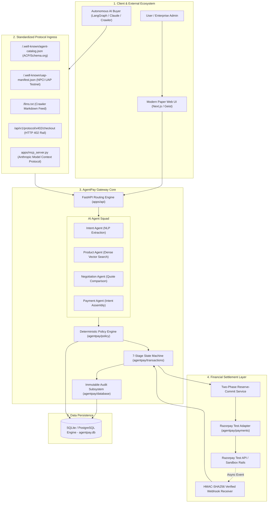
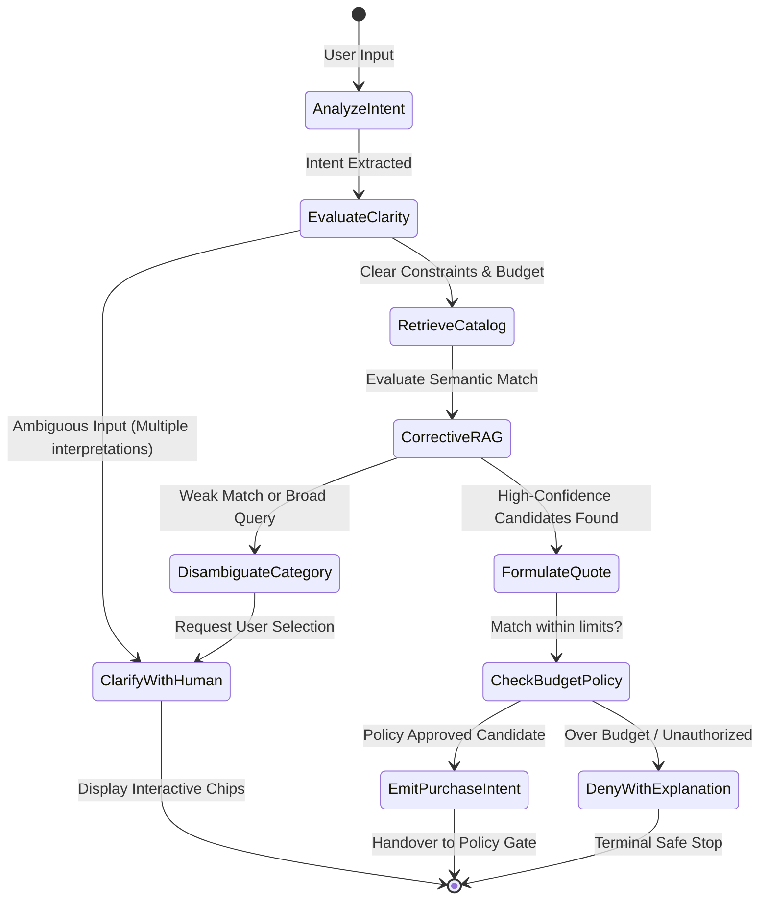
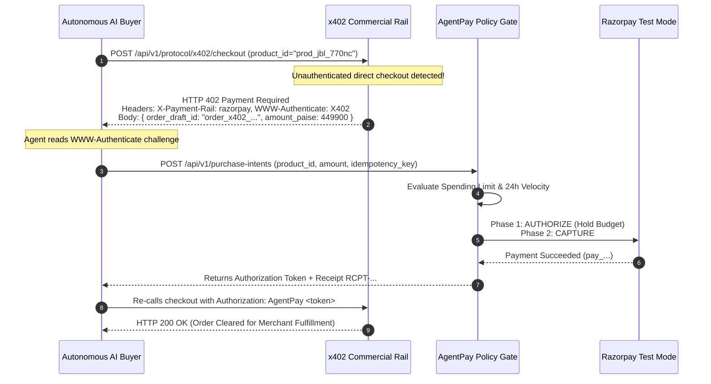
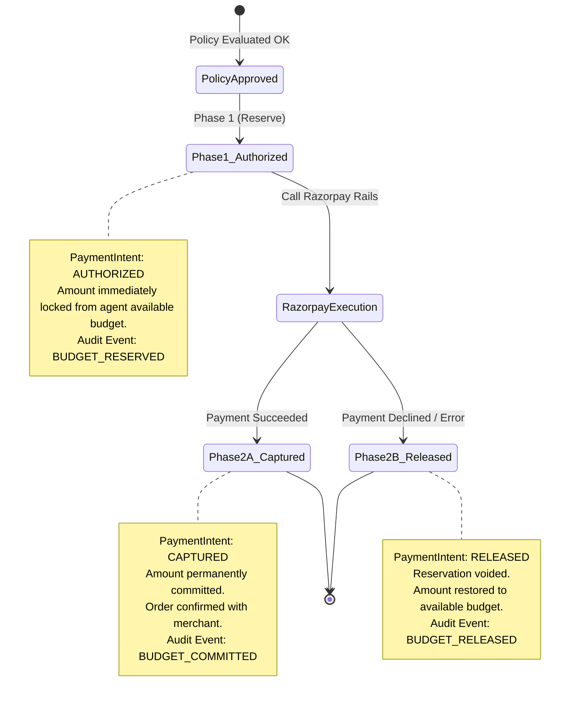
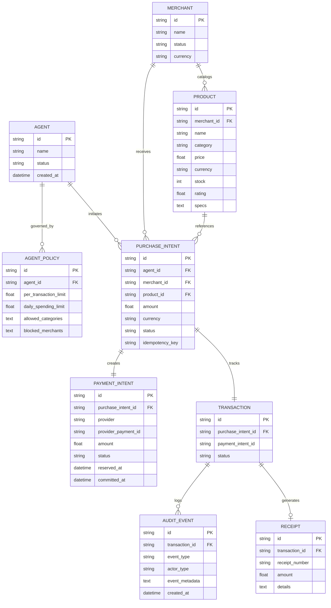

# AgentPay: Comprehensive Project Architecture & Learning Guide

> **Autonomous AI Commerce Gateway on Razorpay Test-Mode Rails**  
> *Track 01: AI Growth & Agentic Commerce*  
> *Core System Invariant: "The AI can decide and request; only AgentPay can authorize and execute money movement."*

---

## Table of Contents
1. [Project Vision & Core Problem Statement](#1-project-vision--core-problem-statement)
2. [High-Level Architecture & Topology](#2-high-level-architecture--topology)
3. [The Core Security Invariant](#3-the-core-security-invariant)
4. [Component 1: AI Agent & Retrieval Engine](#4-component-1-ai-agent--retrieval-engine)
5. [Component 2: Standardized Protocol Layer](#5-component-2-standardized-protocol-layer)
6. [Component 3: Deterministic Policy Engine](#6-component-3-deterministic-policy-engine)
7. [Component 4: Two-Phase Financial Settlement (Razorpay)](#7-component-4-two-phase-financial-settlement-razorpay)
8. [Component 5: Deterministic State Machine & Audit Trail](#8-component-5-deterministic-state-machine--audit-trail)
9. [Component 6: Database Architecture & Schema Models](#9-component-6-database-architecture--schema-models)
10. [Component 7: Modern Paper Frontend Application](#10-component-7-modern-paper-frontend-application)
11. [Verification & Automated Test Suite (45 Tests)](#11-verification--automated-test-suite-45-tests)
12. [Complete Directory & Codebase File Map](#12-complete-directory--codebase-file-map)
13. [Developer Runbook: Setup, Execution & Extension](#13-developer-runbook-setup-execution--extension)

---

## 1. Project Vision & Core Problem Statement

### 1.1 The Paradigm Shift to Agentic Commerce
Traditional e-commerce assumes a human is sitting in front of a screen: browsing items, evaluating prices, reading reviews, filling a shopping cart, and manually entering credit card or UPI credentials.

In 2026, commerce is transitioning to **autonomous AI agents**:
- **AI Buyers** research specifications, compare multi-merchant catalogs, and negotiate quotes on behalf of humans or enterprises.
- **Global Protocols** (NPCI’s Unified Autonomous Platform - UAP, Agent Commerce Protocol - ACP, and HTTP 402 - x402) are emerging to standardize how machines discover inventory and exchange value.

### 1.2 The Catastrophic Failure Mode of Naive Agent Commerce
If an LLM or autonomous agent is directly given raw payment credentials (e.g. credit card numbers, UPI PINs, or raw API secret keys), the system becomes vulnerable to:
1. **Prompt Injection & Jailbreaks**: Malicious web content or prompt manipulation instructing the LLM to drain funds.
2. **Hallucination & Math Errors**: An agent miscalculating prices or currency units (e.g., confusing USD with INR, or Rupees with Paise).
3. **Runaway Loops**: Autonomous agent retry loops repeatedly firing charges until bank accounts are emptied.

### 1.3 The AgentPay Solution
**AgentPay sits as an immutable, deterministic control gateway between the AI’s decision and the payment gateway’s financial execution.**

The LLM is treated as an untrusted advisory client:
- The AI can search catalogs, compare quotes, ask for clarification, and emit a **Purchase Intent**.
- The AI **never** receives credit card credentials, never controls bank tokens, and cannot bypass spending policies.
- AgentPay's deterministic policy engine evaluates spending limits, rolling 24-hour velocity, merchant blocklists, and category whitelists.
- Only upon deterministic approval does AgentPay lock funds (Phase 1: `AUTHORIZED`) and dispatch settlement to **Razorpay test-mode rails** (Phase 2: `CAPTURED`).

---

## 2. High-Level Architecture & Topology



---

## 3. The Core Security Invariant

```
┌────────────────────────────────────────────────────────────────────────┐
│                        CORE SYSTEM INVARIANT                           │
│                                                                        │
│   "The AI can decide and request;                                      │
│    only AgentPay can authorize and execute money movement."            │
└────────────────────────────────────────────────────────────────────────┘
```

### Why this rule is strictly enforced in code:
1. **Zero Financial Tools in LLM Prompts**: The LLM’s tool registry contains only safe tools:
   - `search_products(query, min_price, max_price, category)`
   - `get_quote(product_id)`
   - `request_clarification(question, options)`
   - `create_purchase_intent(product_id, amount, idempotency_key)`
2. **Explicitly Forbidden Tools**:
   The gateway and MCP servers explicitly reject and block tools such as:
   - `charge_card`
   - `transfer_money`
   - `modify_policy`
   - `direct_debit`
   - `access_payment_credentials`
3. **Cryptographic Idempotency**:
   Every purchase intent requires a unique `idempotency_key`. Retrying a timed-out call never creates a duplicate charge or a second budget reservation.

---

## 4. Component 1: AI Agent & Retrieval Engine

### 4.1 LangGraph Multi-Agent Architecture
Rather than a fragile monolithic prompt, AgentPay organizes agentic logic into a deterministic **LangGraph StateGraph** located in `agentpay/agents/graph.py`:



### 4.2 Multi-Attribute Dense Semantic Search
Located in `agentpay/merchants/retrieval.py`:
- **Hybrid Retrieval**: Combines semantic embeddings (via `sentence-transformers` `all-MiniLM-L6-v2`) with structured SQL attribute filters.
- **Spec Dictionary Scoring**: Catalog items contain rich technical specs dictionaries (e.g., `{"anc": true, "battery_life": "70h", "connectivity": "bluetooth_5.3"}`). The retrieval engine parses natural language queries (e.g. *"noise cancelling headphones with 50+ hours battery"*) and matches them against product spec keys.
- **Discrimination Integrity**: Eradicates false-positive cross-category matches. A search for *"wireless mouse"* strictly discards webcams, keyboards, and earbuds regardless of embedding proximity.

### 4.3 Multi-Merchant Quote Comparison
Located in `agentpay/merchants/service.py`:
- Aggregates live bids from multiple verified merchants (e.g. *Croma*, *Reliance Digital*, *Amazon Prime Direct*).
- Allows autonomous agents to rank quotes based on lowest price, fastest delivery, warranty coverage, or trust score.

---

## 5. Component 2: Standardized Protocol Layer

AgentPay exposes the complete suite of emerging agentic commerce protocols, positioning the gateway at the forefront of Track 01.

### 5.1 Protocol Matrix
| Protocol Route | Standard / Specification | Target Audience | Primary Purpose |
| :--- | :--- | :--- | :--- |
| **`GET /.well-known/agent-catalog.json`** | Agent Commerce Protocol (ACP) & Schema.org/Product | Autonomous shopping agents, crawlers | Exposes verified SKUs, stock counts, 300s guaranteed quote TTLs, and Razorpay test-mode rail descriptors. |
| **`GET /.well-known/uap-manifest.json`** | NPCI Unified Autonomous Platform (UAP v0.4) | NPCI network federations | Declares gateway identity (`gateway.agentpay.in`), network role (`AGENT_COMMERCE_GATEWAY`), and trust envelope on `in.npci.uap.testnet`. |
| **`GET /.well-known/ai-plugin.json`** | OpenAI Plugin Standard | ChatGPT, Claude, LangChain | Zero-config manifest for external LLM tool integration. |
| **`GET /llms.txt`** | LLM Markdown Plaintext Standard | LLM web spiders, prompt injection | Clean markdown text feed enabling fast LLM crawler grounding without JSON token overhead. |
| **`POST /api/v1/protocol/x402/checkout`** | HTTP 402 Payment Required Standard | Autonomous AI buyers | Halts unauthenticated checkouts with status `402`, returns Razorpay order draft metadata, and specifies the `POST /api/v1/purchase-intents` resolution endpoint. |
| **`apps/mcp_server.py` & `/api/v1/mcp/tools`** | Model Context Protocol (Anthropic 2024-11-05) | Claude Desktop, Cursor, local agents | Stdio and HTTP tool calling server exposing catalog discovery and purchase intent assembly. |

### 5.2 The x402 Protocol Challenge Lifecycle


---

## 6. Component 3: Deterministic Policy Engine

Located in `agentpay/policy/engine.py`.

### 6.1 Policy Rules Evaluated
Every single purchase intent passes through 4 deterministic checks before any payment call is attempted:
1. **Per-Transaction Spending Limit**:
   $$\text{Intent Amount} \le \text{per\_transaction\_limit}$$
   *(Default: ₹5,000.00 INR)*
2. **Cumulative Rolling 24-Hour Velocity**:
   $$\text{Spent in last 24h} + \text{Currently Reserved} + \text{Intent Amount} \le \text{daily\_spending\_limit}$$
   *(Default: ₹20,000.00 INR)*
3. **Category Whitelist**:
   The product’s category (e.g. `audio`, `electronics`, `office`) must exist in `policy.allowed_categories`.
4. **Merchant Blocklist**:
   The merchant ID must not exist in `policy.blocked_merchants`.

### 6.2 Guaranteed Terminal Dead-End
If any policy check fails, the transaction transitions immediately to **`DENIED`**.
- This state is mathematically terminal: the state machine throws an `InvalidStateTransitionError` if any code tries to advance a `DENIED` transaction.
- **Zero payment calls, zero token requests, and zero network dispatches are ever made to Razorpay.**

---

## 7. Component 4: Two-Phase Financial Settlement (Razorpay)

Located in `agentpay/payments/service.py` and `agentpay/payments/razorpay.py`.

### 7.1 Two-Phase Reserve-Then-Commit Lifecycle
AgentPay natively maps to Razorpay's two-phase authorization lifecycle (`payment_capture=0` $\rightarrow$ `payment_capture=1`):



### 7.2 Enterprise Razorpay Features
1. **Order Notes & Dashboard Reconciliation**:
   Every order created in Razorpay attaches rich enterprise metadata:
   ```json
   {
     "notes": {
       "agent_id": "agent_001",
       "purchase_intent_id": "pi_9f83a12b4e7c",
       "policy_id": "policy_001",
       "merchant_id": "merchant_001",
       "transaction_id": "tx_4a91c28f7d0e",
       "idempotency_key": "idem_12345678",
       "gateway": "AgentPay-v1.1"
     }
   }
   ```
   *Benefit*: Finance teams can filter and reconcile autonomous agent spending directly in their standard Razorpay Merchant Dashboard.
2. **Cryptographic Webhook Verification (HMAC-SHA256)**:
   Located in `apps/api/routes/webhooks.py`:
   - Computes expected signature: `hmac.new(secret, body, hashlib.sha256).hexdigest()`.
   - Validates incoming `X-Razorpay-Signature` using timing-safe `hmac.compare_digest` to prevent timing attacks.
3. **Anti-Replay Protection**:
   Maintains a deduplication set `PROCESSED_WEBHOOK_EVENT_IDS` tracking `X-Razorpay-Event-Id` and event IDs. Duplicate retransmissions or replay attacks are safely acknowledged with `DUPLICATE_REPLAY_IGNORED` without corrupting state.
4. **Network Timeout Fallback & Idempotent Retries**:
   If network latency causes Razorpay API calls to time out, the transaction safely remains in `PaymentIntent: AUTHORIZED` reserve. Retrying with the same `idempotency_key` reconnects to the existing reservation and completes capture without duplicate charges or double budget deductions.

---

## 8. Component 5: Deterministic State Machine & Audit Trail

Located in `agentpay/transactions/state_machine.py`.

### 8.1 The 7 Deterministic States
```
1. CREATED
     │
2. POLICY_CHECKED
     ├──> DENIED (Terminal: zero money moved)
     │
3. APPROVED (Phase 1: Funds Locked in AUTHORIZED Reserve)
     │
4. PAYMENT_CREATED (Razorpay Order Dispatched)
     ├──> PAYMENT_FAILED (Phase 2B: Funds Released back to budget)
     │
5. PAYMENT_SUCCESS (Phase 2A: Funds Committed / CAPTURED)
     │
6. ORDER_CONFIRMED (Merchant Inventory Decremented)
     │
7. RECEIPT_GENERATED (Itemized Cryptographic Receipt Issued)
```

### 8.2 Immutable Audit Trail
Every single state transition writes an immutable `AuditEvent` record containing:
- `id`: Unique audit event ID (`audit_...`)
- `transaction_id`: Target transaction
- `event_type`: (e.g. `BUDGET_RESERVED`, `PAYMENT_CAPTURED`, `BUDGET_COMMITTED`)
- `actor_type`: (`AI_BUYER`, `POLICY_ENGINE`, `PAYMENT_SERVICE`, `MERCHANT_SERVICE`, `SYSTEM`)
- `event_metadata`: Full JSON snapshot of available budget, currently reserved funds, notes, and error codes.
- `created_at`: High-resolution UTC timestamp.

---

## 9. Component 6: Database Architecture & Schema Models

Located in `agentpay/database/models.py`.



---

## 10. Component 7: Modern Paper Frontend Application

Located in `apps/web/`.

### 10.1 Design Philosophy ("Modern Paper")
Inspired by high-end financial documents and clean minimalist typography:
- **Typography**: Uses Geist font (`geistSans` and `geistMono`) with crisp tabular numbers for financial data.
- **Color Palette**: Warm parchment surfaces (`#FAF8F5`, `#F3EFEA`), charcoal ink typography (`#1B1C1C`), and Razorpay-inspired vibrant terracotta accents (`#FE7352`, `#AA361A`).
- **Surface Elevation**: Micro-borders, subtle paper shadows (`paper-card`), and zero generic primary colors.

### 10.2 Pages & Key Interfaces
1. **Buy / Chat Interface (`apps/web/pages/index.tsx` & `chat.tsx`)**:
   - Conversational AI shopping interface.
   - Streams agent thoughts (`Intent Analysis`, `Catalog Search`, `Policy Evaluation`).
   - Renders interactive clarification chips when queries are ambiguous.
   - Shows live reserve-then-commit progression bar.
2. **Merchants & Catalog (`apps/web/pages/merchants.tsx`)**:
   - Certified merchant networks with live inventory search.
   - Host for the **Protocol Hub (UAP · x402 · llms.txt)** modal.
3. **Control & Policies (`apps/web/pages/control.tsx` & `policy.tsx`)**:
   - Real-time spending limits sandbox.
   - Daily velocity gauges and category whitelists.
4. **Audit Timeline & Evidence (`apps/web/pages/history.tsx` & `evidence.tsx`)**:
   - Visual inspection of the immutable 7-stage audit stream.
   - Digital tax receipt modal with verification hashes.

---

## 11. Verification & Automated Test Suite (45 Tests)

The entire codebase is verified by **45 automated pytest tests**, achieving a 100% pass rate.

### 11.1 Test Suite Breakdown
```bash
python -m pytest tests/ -v
```

| Test File | Tests | Capabilities Verified |
| :--- | :---: | :--- |
| **`tests/test_policy_engine.py`** | 4 | Under-limit approval, over-limit denial, category whitelists, merchant blocklists. |
| **`tests/test_state_machine.py`** | 3 | Valid 7-stage state flow, invalid state transition rejection, terminal DENIED immutability. |
| **`tests/test_security_boundary.py`** | 1 | Strict tool calling isolation (raw financial tools forbidden). |
| **`tests/test_purchase_intent_flow.py`** | 4 | End-to-end approved scenario, overspending denial, graceful card decline rollback, two-phase reserve-then-commit and release. |
| **`tests/test_semantic_retrieval.py`** | 5 | Natural language constraint ranking, multi-attribute specs extraction, quote price sorting. |
| **`tests/test_multi_product_retrieval.py`** | 6 | Earbuds vs headphones discrimination, mouse queries excluding webcams, multi-category consistency. |
| **`tests/test_mcp_server.py`** | 7 | MCP tool schema compliance, stdio execution, HTTP manifest API, forbidden tool boundaries. |
| **`tests/test_langgraph_pipeline.py`** | 4 | Direct SKU retrieval, clarification branch on ambiguity, corrective RAG routing, autonomous checkout. |
| **`tests/test_protocol_manifests.py`** | 6 | ACP catalog schema, NPCI UAP testnet manifest, OpenAI plugin, /llms.txt feed, x402 HTTP 402 challenge. |
| **`tests/test_razorpay_enterprise.py`** | 5 | Order notes injection (`agent_id`, `purchase_intent_id`, `policy_id`), HMAC webhook verification, replay defense, timeout idempotent retry. |
| **Total** | **45** | **100% Passing (0 failures, 0 regressions)** |

---

## 12. Complete Directory & Codebase File Map

```
d:/project/Razorpay/AgentPay/
├── agentpay/                       # Core Python Backend Library
│   ├── agents/                     # AI Buyer Agent Squad
│   │   ├── buyer.py                # Monolithic & Tool Registry Agent
│   │   ├── graph.py                # LangGraph StateGraph & Corrective RAG
│   │   ├── intent.py               # NLP Intent & Constraint Extraction
│   │   ├── product.py              # Semantic Catalog Retrieval Agent
│   │   ├── negotiation.py          # Quote Comparison & Selection Agent
│   │   └── payment.py              # Purchase Intent Formulation Agent
│   ├── database/                   # SQLite Persistence Layer
│   │   ├── models.py               # SQLAlchemy ORM Models & DB Session
│   │   └── seed.py                 # Initial Seed Data (137 realistic SKUs & merchants)
│   ├── merchants/                  # Merchant & Inventory Services
│   │   ├── retrieval.py            # SentenceTransformer Dense Vector Search
│   │   └── service.py              # Multi-Merchant Inventory & Quote Engine
│   ├── payments/                   # Financial Settlement Layer
│   │   ├── razorpay.py             # Razorpay Test Adapter & Sandbox Simulator
│   │   └── service.py              # Two-Phase Reserve-Then-Commit Service
│   ├── policy/                     # Governance & Rules Engine
│   │   └── engine.py               # Limits, Velocity, Whitelists & Blocklists
│   └── transactions/               # Transaction Lifecycle Management
│       ├── service.py              # End-to-End Intent & Payment Orchestrator
│       └── state_machine.py        # 7-Stage Deterministic State Machine
│
├── apps/                           # Application Entry Points & Transports
│   ├── api/                        # FastAPI REST Server
│   │   ├── main.py                 # App initialization, CORS, Router mounting
│   │   └── routes/                 # Modular API Endpoints
│   │       ├── protocol.py         # UAP, ACP, x402, llms.txt endpoints
│   │       ├── webhooks.py         # Razorpay HMAC Webhook Receiver & Replay Guard
│   │       ├── purchase_intents.py # Purchase intent creation & reservation
│   │       ├── policies.py         # Policy sandbox evaluation & CRUD
│   │       ├── products.py         # Public product search & verified quotes
│   │       ├── transactions.py     # Transaction status & audit logs
│   │       ├── receipts.py         # Itemized cryptographic receipts
│   │       └── mcp.py              # HTTP Model Context Protocol manifest
│   ├── mcp_server.py               # Anthropic Stdio Model Context Protocol Server
│   └── web/                        # Modern Paper Next.js Frontend
│       ├── pages/                  # Page Routes
│       │   ├── index.tsx           # Conversational AI Shopping Interface
│       │   ├── merchants.tsx       # Approved Merchants & Protocol Hub Host
│       │   ├── control.tsx         # Policy & Spending Limits Sandbox
│       │   └── history.tsx         # Audit Trail & Transaction Evidence
│       ├── components/             # Reusable UI Components
│       │   ├── ProtocolModal.tsx   # Interactive Protocol Explorer (x402 tester)
│       │   ├── ReceiptModal.tsx    # Digital Tax Receipt Card
│       │   ├── FloatingNav.tsx     # Pill-shaped Glass Navigation Bar
│       │   └── Logo.tsx            # Organic Brain SVG Brand Identity
│       ├── styles/                 # Tailwind CSS & Global Styles
│       └── types/                  # TypeScript Data Contracts
│
├── tests/                          # Automated Pytest Verification Suite
│   ├── conftest.py                 # SQLite in-memory test database fixture (StaticPool)
│   ├── test_policy_engine.py       # Deterministic policy enforcement tests
│   ├── test_state_machine.py       # State machine transition invariant tests
│   ├── test_purchase_intent_flow.py# Full two-phase lifecycle & failure rollback tests
│   ├── test_semantic_retrieval.py  # Dense vector ranking & specs tests
│   ├── test_langgraph_pipeline.py  # Multi-agent LangGraph workflow tests
│   ├── test_mcp_server.py          # MCP tool schema & execution tests
│   ├── test_protocol_manifests.py  # UAP, ACP, x402, and llms.txt protocol tests
│   └── test_razorpay_enterprise.py # Notes, HMAC webhooks, anti-replay, retry tests
│
├── agentpay.db                     # Active Local SQLite Database
├── requirements.txt                # Python Backend Dependencies
├── package.json                    # Frontend Next.js Dependencies
└── SYSTEM_DESIGN_AND_PROGRESS.md   # Architectural Source of Truth & Milestone Matrix
```

---

## 13. Developer Runbook: Setup, Execution & Extension

### 13.1 Environment Configuration (`.env`)
Create a `.env` file in the root directory:
```bash
# Razorpay Test Mode Credentials
RAZORPAY_KEY_ID=rzp_test_placeholder_agentpay
RAZORPAY_KEY_SECRET=rzp_secret_placeholder_agentpay
RAZORPAY_WEBHOOK_SECRET=test_webhook_secret_agentpay_2026

# Database & Server Settings
DATABASE_URL=sqlite:///./agentpay.db
PORT=8000
ENVIRONMENT=development
```

### 13.2 Starting the Servers
1. **Start Python Backend Server (FastAPI on Port 8000)**:
   ```bash
   python -m uvicorn apps.api.main:app --host 127.0.0.1 --port 8000 --reload
   ```
2. **Start Frontend Next.js Server (Port 3000)**:
   ```bash
   npm run dev
   ```

### 13.3 Executing the Test Suite
Run all 45 invariant tests:
```bash
python -m pytest tests/ -v
```

### 13.4 How to Add a New Product SKU
To add a new item to the verified catalog, open `agentpay/database/seed.py` and append to `seed_database()`:
```python
Product(
    id="prod_my_new_sku",
    merchant_id="merchant_001",
    name="Ultra-Light Wireless Gaming Mouse",
    brand="ProGamer",
    category="accessories",
    price=5999.0,
    currency="INR",
    stock=25,
    rating=4.9,
    _specs=json.dumps({
        "dpi": "30000",
        "weight": "49g",
        "connectivity": "2.4GHz + Bluetooth"
    })
)
```
Upon restart, the item will immediately appear in:
- The Next.js Merchant Catalog (`/merchants`)
- `/.well-known/agent-catalog.json` (ACP Schema)
- `/llms.txt` (Plaintext Feed)
- Dense Vector Semantic Search
- `/api/v1/protocol/x402/checkout`

---
*Document Version: 2.0.0 — Verified for Track 01 Submission*
