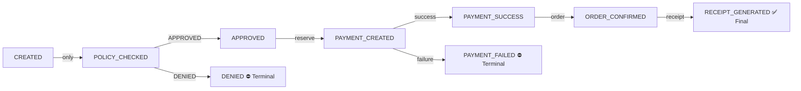
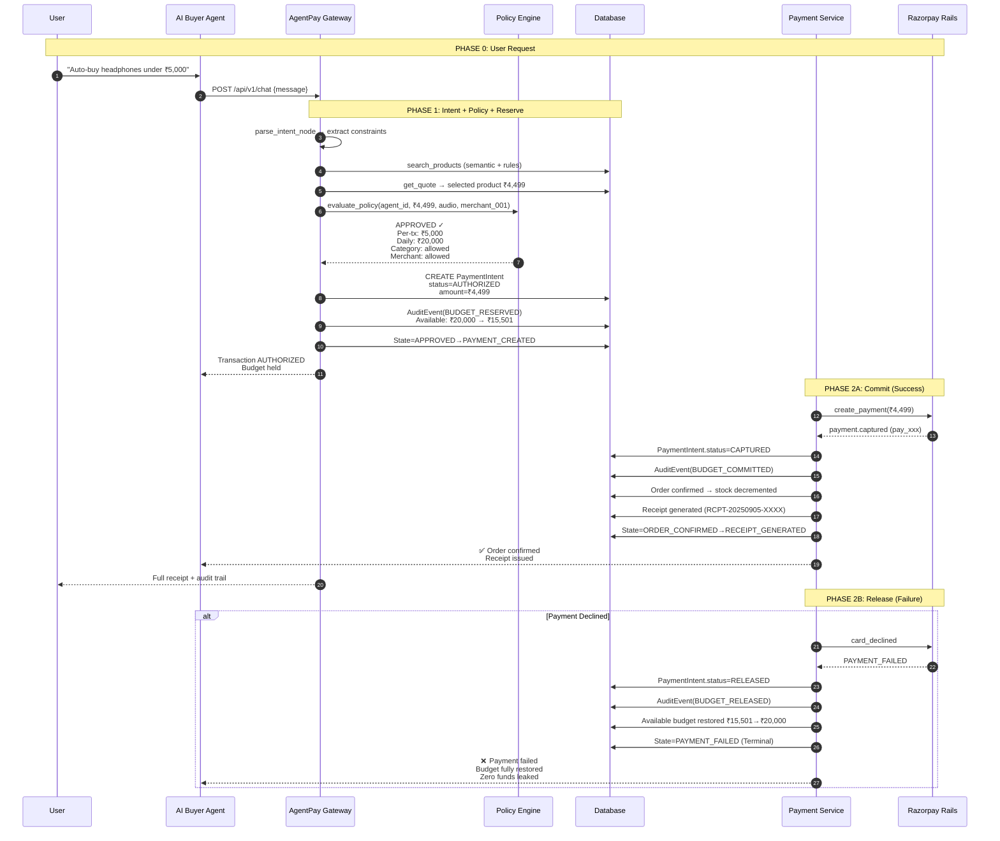
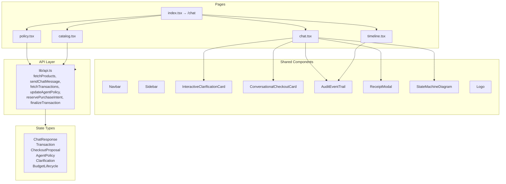
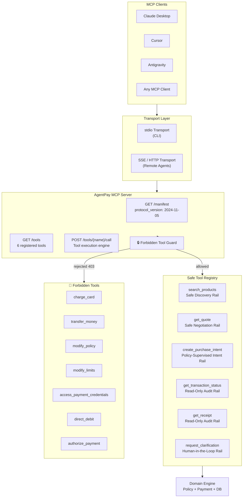
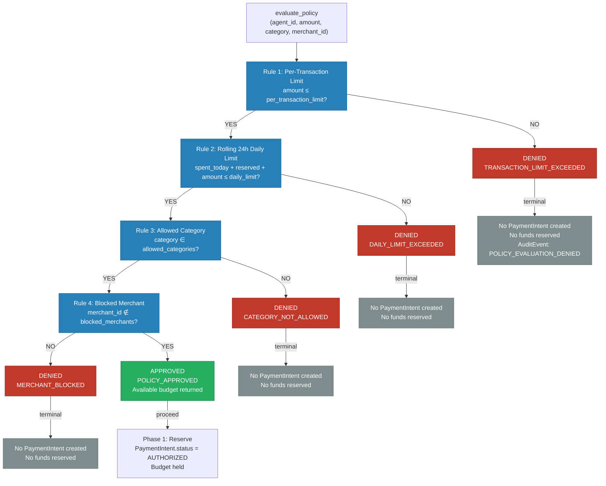
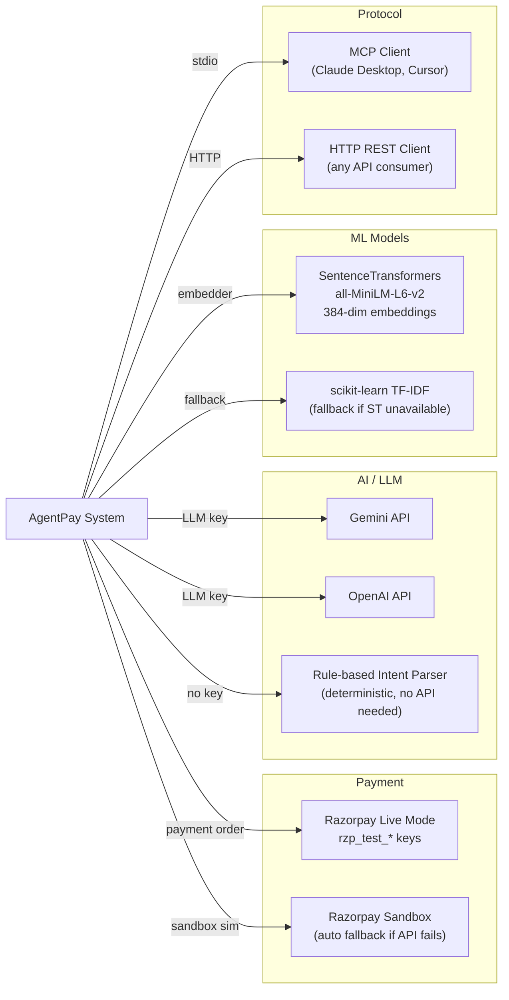
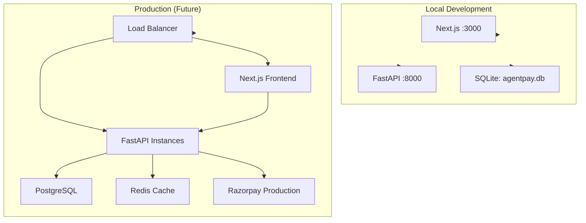

# AgentPay — System Architecture Diagram

> **Core Invariant:** *The AI can decide. Only AgentPay can authorize money.*

---

## 1. High-Level System Architecture

```mermaid
flowchart TB
    subgraph UL["👤 User Layer"]
        USER(["User"])
        WEB["Next.js Web App<br/>localhost:3000"]
    end

    subgraph AI["🧠 AI Buyer Layer"]
        LLM["LLM (Gemini/OpenAI)<br/>Tool-Calling Loop"]
        MCP["MCP Server<br/>stdio / SSE"]
        LANG["LangGraph Pipeline<br/>6 Nodes"]
    end

    subgraph GW["🛡️ AgentPay Gateway (FastAPI :8000)"]
        CHAT["Chat Router<br/>POST /api/v1/chat"]
        PI["Purchase Intents Router"]
        PM["Payments Router"]
        TX["Transactions Router"]
        PR["Products Router"]
        PL["Policies Router"]
        RC["Receipts Router"]
        MCP_R["MCP Router<br/>/api/v1/mcp/*"]
        WH["Webhooks Router"]
    end

    subgraph DOM["📦 Domain Engine"]
        INTENT["Intent Agent<br/>NLP / Constraints"]
        PRODUCT["Product Agent<br/>Semantic Retrieval"]
        NEG["Negotiation Agent<br/>Quote Comparison"]
        PAY["Payment Agent<br/>Intent Assembly"]
        POL["Policy Engine<br/>4 Deterministic Rules"]
        SM["State Machine<br/>9 States"]
        TXS["Transaction Service<br/>2-Phase Reserve-Commit"]
        PMT["Payment Service<br/>Reserve / Commit / Release"]
        RZR["Razorpay Adapter<br/>Sandbox / Live"]
        RCP["Receipt Service"]
    end

    subgraph DB["💾 Data Layer (SQLite)"]
        A["agents"]
        AP["agent_policies"]
        M["merchants"]
        P["products"]
        PUR["purchase_intents"]
        PI2["payment_intents"]
        T["transactions"]
        AE["audit_events"]
        R["receipts"]
    end

    subgraph EXT["🔗 External Systems"]
        RZ["Razorpay Test Mode"]
        EMB["SentenceTransformers<br/>all-MiniLM-L6-v2"]
        SK["scikit-learn TF-IDF<br/>(fallback)"]
    end

    %% User → AI
    USER -->|"types message" WEB
    WEB -->|"POST /api/v1/chat" CHAT

    %% AI → Gateway
    LLM -.->|"tool calls" MCP
    MCP -->|"HTTP REST" MCP_R
    LANG -->|"invoke" TXS

    %% Gateway → Domain
    CHAT --> INTENT
    CHAT --> PRODUCT
    CHAT --> NEG
    CHAT --> PAY
    PI --> TXS
    PM --> PMT
    TX --> SM
    TX --> TXS
    PR --> PRODUCT
    PL --> POL
    RC --> RCP
    MCP_R --> INTENT
    MCP_R --> PRODUCT
    MCP_R --> TXS
    MCP_R --> RCP

    %% Domain → Domain
    INTENT -->|"structured intent" PRODUCT
    PRODUCT -->|"ranked products" NEG
    NEG -->|"selected quote" PAY
    PAY -->|"purchase intent" TXS
    TXS --> POL
    POL -->|APPROVED| PMT
    POL -->|DENIED| SM
    PMT -->|reserve| PI2
    PMT -->|commit| RZR
    PMT -->|release| PI2
    RZR -->|payment result| PMT
    PMT -->|success| RCP
    RCP -->|receipt| SM
    PMT -->|failure| SM
    TXS -->|state transition| SM
    SM -->|audit event| AE

    %% Domain → DB
    A --> AP
    M --> P
    PUR --> T
    PI2 --> T
    T --> AE
    T --> R
    TXS -.-> PUR
    TXS -.-> PI2
    TXS -.-> T
    PMT -.-> PI2
    RCP -.-> R
    SM -.-> AE

    %% Domain → External
    PRODUCT -->|dense vectors| EMB
    PRODUCT -->|fallback| SK
    PMT -->|payment call| RZ

    %% Styling
    classDef layer fill:#1a1a2e,stroke:#16213e,stroke-width:2px,color:#e0e0e0
    classDef service fill:#0f3460,stroke:#1a5276,stroke-width:1px,color:#fff
    classDef data fill:#1b4332,stroke:#2d6a4f,stroke-width:1px,color:#fff
    classDef ext fill:#3d2c00,stroke:#8a7100,stroke-width:1px,color:#fff

    class UL,AI,DB,EXT layer
    class GW service
    class DOM,EMB,SK,RZ service
```

---

## 2. Transaction State Machine

```mermaid
stateDiagram-v2
    [*] --> CREATED: AI Buyer emits Purchase Intent
    CREATED --> POLICY_CHECKED: Policy evaluation starts

    POLICY_CHECKED --> APPROVED: All 4 rules pass
    POLICY_CHECKED --> DENIED: Any rule fails

    APPROVED --> PAYMENT_CREATED: Reserve funds (AUTHORIZED)
    DENIED --> [*]: TERMINAL — Zero funds touched

    PAYMENT_CREATED --> PAYMENT_SUCCESS: Razorpay captures
    PAYMENT_CREATED --> PAYMENT_FAILED: Card declined / error

    PAYMENT_FAILED --> [*]: TERMINAL — Hold released (RELEASED)

    PAYMENT_SUCCESS --> ORDER_CONFIRMED: Merchant order booked
    ORDER_CONFIRMED --> RECEIPT_GENERATED: Tax receipt issued
    RECEIPT_GENERATED --> [*]: FINAL SUCCESS — Funds committed (CAPTURED)

    state DENIED as "🔴 DENIED<br/>Terminal State<br/>No payment attempted"
    state PAYMENT_FAILED as "🟡 PAYMENT_FAILED<br/>Terminal State<br/>Hold released"
    state RECEIPT_GENERATED as "🟢 RECEIPT_GENERATED<br/>Final Success<br/>Funds committed"
```

### State Transition Rules



---

## 3. Two-Phase Reserve-Then-Commit Lifecycle



---

## 4. Frontend Architecture



---

## 5. MCP Server Architecture



---

## 6. Data Model Relationships

```mermaid
erDiagram
    agents ||--o{ agent_policies : "one-to-one"
    agents ||--o{ purchase_intents : "one-to-many"
    merchants ||--o{ products : "one-to-many"
    purchase_intents ||--o{ payment_intents : "one-to-one"
    purchase_intents ||--o{ transactions : "one-to-one"
    transactions ||--o{ audit_events : "one-to-many"
    transactions ||--o{ receipts : "one-to-one"
    payment_intents }|--|| transactions : "fk payment_intent_id"

    agents {
        string id PK
        string name
        string status
        datetime created_at
    }
    agent_policies {
        string id PK
        string agent_id FK
        float per_transaction_limit  default 5000.0
        float daily_spending_limit   default 20000.0
        json allowed_categories
        json blocked_merchants
        string currency              default "INR"
    }
    merchants {
        string id PK
        string name
        string status
        string currency
    }
    products {
        string id PK
        string merchant_id FK
        string name
        string brand
        string category
        float price
        int stock
        float rating
        json specs
    }
    purchase_intents {
        string id PK
        string agent_id FK
        string merchant_id FK
        string product_id FK
        float amount
        string status
        string idempotency_key
    }
    payment_intents {
        string id PK
        string purchase_intent_id FK UNIQUE
        string provider              default "RAZORPAY"
        string provider_payment_id
        float amount
        string status
        datetime reserved_at
        datetime committed_at
        datetime released_at
    }
    transactions {
        string id PK
        string purchase_intent_id FK UNIQUE
        string payment_intent_id FK
        string status
        datetime created_at
        datetime updated_at
    }
    audit_events {
        string id PK
        string transaction_id FK
        string event_type
        string actor_type
        json metadata_json
        datetime created_at
    }
    receipts {
        string id PK
        string transaction_id FK UNIQUE
        string receipt_number
        float amount
        string status
        json details
    }
```

---

## 7. Policy Engine Decision Flow



---

## 8. Project File Structure

```
AgentPay/
│
├── agentpay/                          # Core Domain Package
│   ├── __init__.py
│   ├── database/
│   │   ├── __init__.py
│   │   ├── models.py                  # SQLAlchemy ORM models (8 tables)
│   │   ├── seed.py                    # 135+ products, 3 merchants, 1 agent
│   │   └── __init__.py
│   ├── policy/
│   │   ├── __init__.py
│   │   └── engine.py                  # 4 deterministic rules + budget summary
│   ├── transactions/
│   │   ├── __init__.py
│   │   ├── state_machine.py           # 9-state deterministic FSM
│   │   └── service.py                 # 2-phase reserve-then-commit orchestration
│   ├── payments/
│   │   ├── __init__.py
│   │   ├── service.py                 # Reserve / Commit / Release
│   │   └── razorpay.py                # RazorpayAdapter + sandbox simulation
│   ├── merchants/
│   │   ├── __init__.py
│   │   ├── service.py                 # Search, quote, order confirm
│   │   └── retrieval.py               # Hybrid dense vector + TF-IDF search
│   ├── agents/
│   │   ├── __init__.py
│   │   ├── buyer.py                   # AIBuyer: safe tool executor + chat
│   │   ├── graph.py                   # LangGraph 6-node pipeline
│   │   ├── intent.py                  # NLP constraint extraction
│   │   ├── product.py                 # Catalog discovery
│   │   ├── negotiator.py              # Quote comparison & selection
│   │   └── payment.py                 # Intent assembly & submission
│   ├── receipts/
│   │   ├── __init__.py
│   │   └── service.py                 # Receipt generation & retrieval
│   └── mcp/
│       ├── __init__.py
│       └── server.py                  # MCP Server: 6 safe tools + forbidden guard
│
├── apps/
│   ├── api/                           # FastAPI Backend :8000
│   │   ├── main.py                    # App factory, lifespan, CORS
│   │   ├── requirements.txt           # fastapi, sqlalchemy, razorpay, langgraph, etc.
│   │   └── routes/
│   │       ├── chat.py                # POST /api/v1/chat
│   │       ├── purchase_intents.py    # POST /api/v1/purchase-intents (+ /reserve)
│   │       ├── payments.py            # POST /api/v1/payment-intents
│   │       ├── transactions.py        # GET/POST /api/v1/transactions (+ /finalize)
│   │       ├── products.py            # GET /api/v1/products (+ /{id}/quote)
│   │       ├── policies.py            # GET/PUT /api/v1/agents/{id}/policy
│   │       ├── receipts.py            # GET /api/v1/receipts/{id}
│   │       ├── mcp.py                 # GET/POST /api/v1/mcp/*
│   │       └── webhooks.py            # POST /api/v1/payments/webhook
│   │
│   └── web/                           # Next.js Frontend :3000
│       ├── package.json
│       ├── next.config.js             # API rewrites to backend
│       ├── pages/
│       │   ├── _app.tsx               # Layout: Sidebar + Navbar
│       │   ├── index.tsx              # Redirect → /chat
│       │   ├── chat.tsx               # Main AI chat + checkout cards
│       │   ├── catalog.tsx            # Product browse + filters
│       │   ├── policy.tsx             # Budget dashboard + policy editor
│       │   └── timeline.tsx           # Transaction ledger + audit trail
│       ├── components/
│       │   ├── Sidebar.tsx
│       │   ├── Navbar.tsx
│       │   ├── Logo.tsx
│       │   ├── InteractiveClarificationCard.tsx
│       │   ├── ConversationalCheckoutCard.tsx
│       │   ├── AuditEventTrail.tsx
│       │   ├── ReceiptModal.tsx
│       │   ├── StateMachineDiagram.tsx
│       │   └── Navbar.tsx
│       ├── lib/
│       │   └── api.ts                 # TypeScript API client
│       ├── styles/
│       │   └── globals.css
│       └── tailwind.config.js
│
├── tests/                             # 34 Tests, All Passing
│   ├── conftest.py                    # In-memory SQLite fixture
│   ├── test_state_machine.py
│   ├── test_policy_engine.py
│   ├── test_purchase_intent_flow.py
│   ├── test_semantic_retrieval.py
│   ├── test_security_boundary.py
│   ├── test_multi_product_retrieval.py
│   ├── test_mcp_server.py
│   ├── test_langgraph_pipeline.py
│   └── run_tests.py
│
├── docs/
│   └── spec.md                        # Full product/technical spec
│
├── issues_fixed.md                    # Documented fixes applied
├── README.md
├── SYSTEM_DESIGN_AND_PROGRESS.md
├── SYSTEM_ARCHITECTURE.md             # This file
├── .env.example
└── agentpay.db                        # SQLite database
```

---

## 9. External Integrations



---

## 10. Deployment Architecture



---

*Generated from `agentpay/` source code and `apps/` route definitions.*
*Verified against running tests: 34 passed, 0 warnings.*
