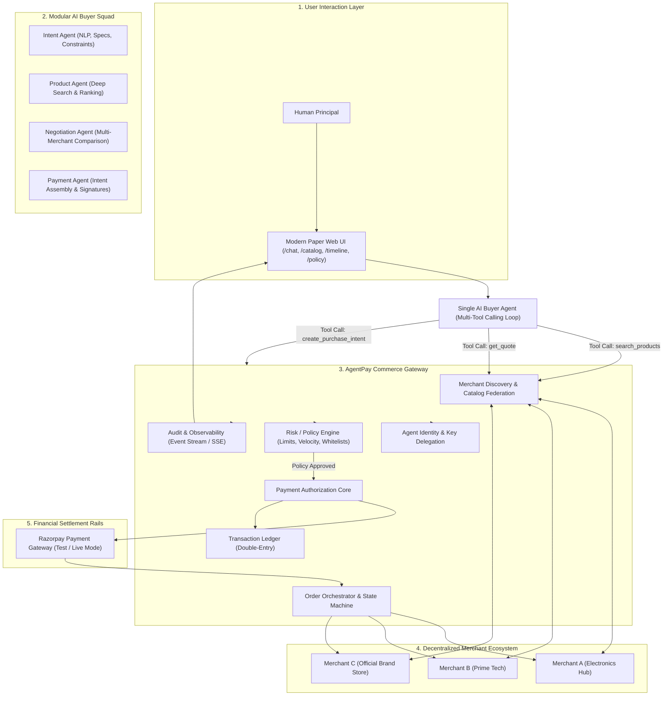
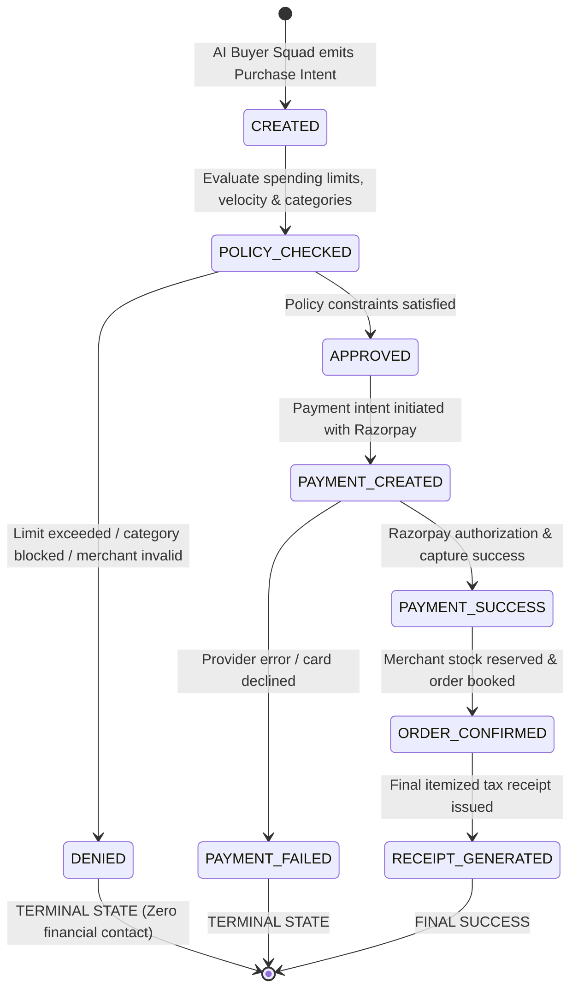
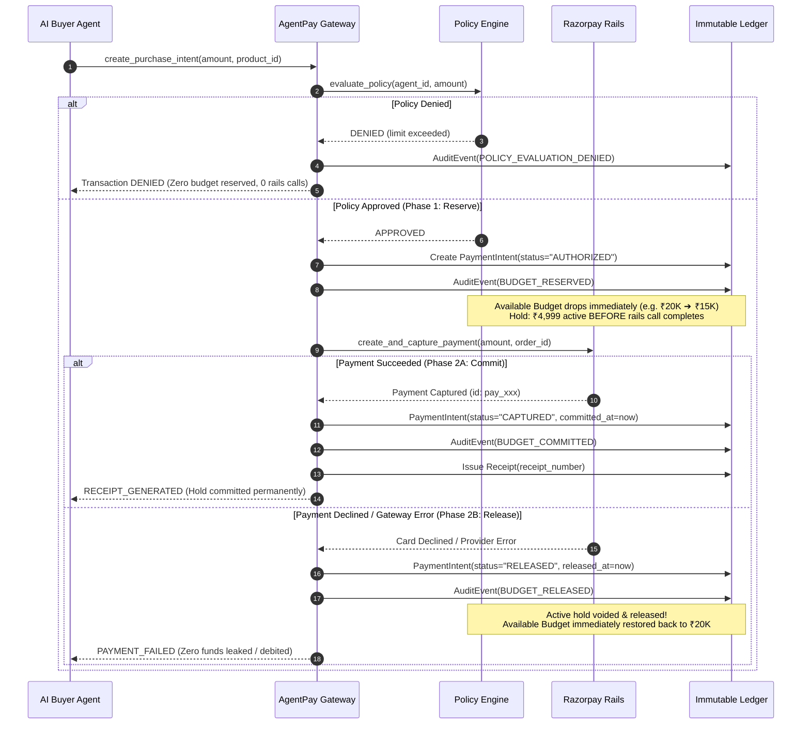
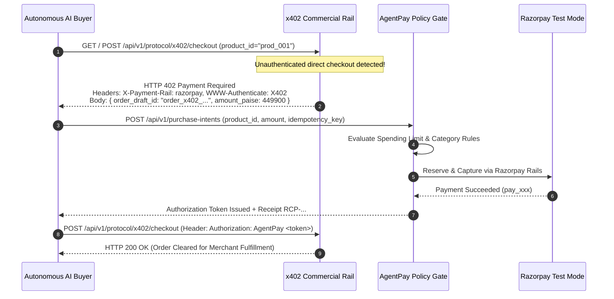
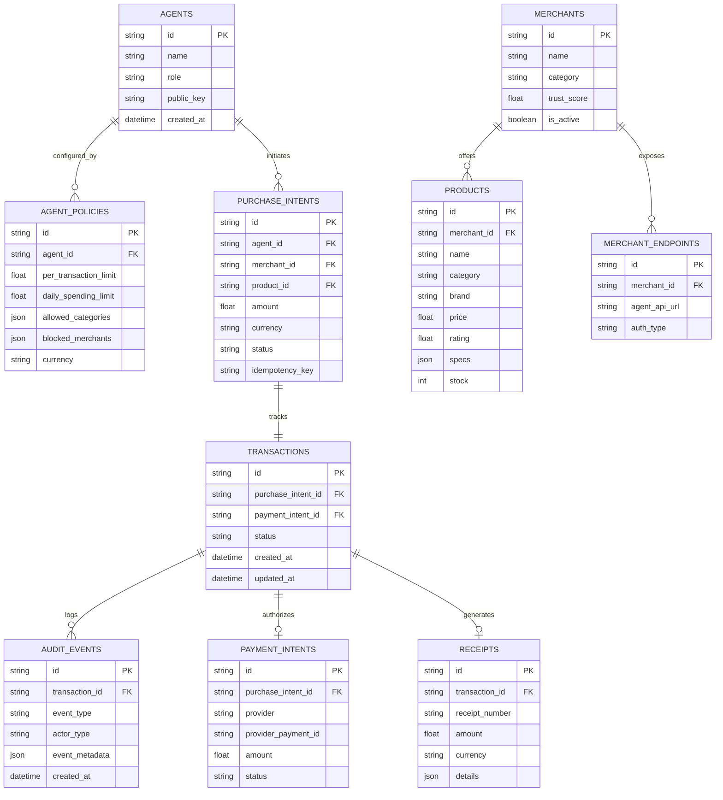

# AgentPay: System Design Guide & Progress Tracker

> **Core System Invariant:** *The AI can decide and request; only AgentPay can authorize and execute money movement.*

---

## 📑 Table of Contents

1. [Executive Summary & Core Value Proposition](#1-executive-summary--core-value-proposition)
2. [Target High-Level Architecture & Ecosystem Design](#2-target-high-level-architecture--ecosystem-design)
3. [Security Boundary & Threat Model](#3-security-boundary--threat-model)
4. [Transaction State Machine & Invariants](#4-transaction-state-machine--invariants)
5. [Data Architecture & Schema Specifications](#5-data-architecture--schema-specifications)
6. [Core Subsystems & Component Design](#6-core-subsystems--component-design)
   - [6.1 Single Autonomous AI Buyer Agent (Multi-Tool Calling Loop)](#61-single-autonomous-ai-buyer-agent-multi-tool-calling-loop)
   - [6.2 AgentPay: Agent Commerce Gateway (7 Pillars)](#62-agentpay-agent-commerce-gateway-7-pillars)
   - [6.3 Standardized Merchant Agent API Contract](#63-standardized-merchant-agent-api-contract)
   - [6.4 Payment Rails Adapter (Razorpay Integration)](#64-payment-rails-adapter-razorpay-integration)
   - [6.5 Modern Paper Design System](#65-modern-paper-design-system)
7. [API & Interface Contracts](#7-api--interface-contracts)
8. [Progress Tracker & Feature Implementation Matrix](#8-progress-tracker--feature-implementation-matrix)
9. [Completed Features & Verification Proofs](#9-completed-features--verification-proofs)
10. [Active & In-Progress Work](#10-active--in-progress-work)
11. [Future Roadmap & Long-Term Milestones](#11-future-roadmap--long-term-milestones)
12. [Verification, Testing & Audit Guide](#12-verification-testing--audit-guide)

---

## 1. Executive Summary & Core Value Proposition

### 1.1 The Problem
In human commerce, checkout boundaries rely on manual confirmation (OTP, CVV, biometric authentication). When autonomous AI agents interact with commerce on behalf of users, standard checkout mechanisms fail:
- **Prompt Injection & Rogue Goals:** Adversarial inputs or prompt hijacking can trick LLMs into unauthorized spending.
- **Price Gouging & Dynamic Traps:** Malicious merchants can inflate prices or alter terms at the moment of payment.
- **Unbounded Hallucination:** Agents can trigger catastrophic bulk orders, invalid items, or repetitive purchases.

### 1.2 The AgentPay Solution
**AgentPay** is a deterministic trust and payment-control gateway inserted between an autonomous AI agent's *decision* and financial *execution rails* (Razorpay). 

```
┌─────────────────────────────────────────────────────────────────────────────┐
│                             AGENTIC COMMERCE FLOW                           │
│                                                                             │
│  User Goal ──▶ Single AI Buyer Agent ──▶ [Intent] ──▶ AgentPay Gateway ──▶ Razorpay
│                (Multi-Tool Calls)        (Requests)     (Authorizes)      (Executes)
└─────────────────────────────────────────────────────────────────────────────┘
```

---

## 2. Target High-Level Architecture & Ecosystem Design

```
                         ┌──────────────────────┐
                         │       HUMAN USER     │
                         │ "Buy monitor < ₹28K" │
                         └──────────┬───────────┘
                                    │
                                    ▼
                         ┌──────────────────────┐
                         │      AI BUYER        │
                         │                      │
                         │ 1. Intent Agent      │
                         │ 2. Product Agent     │
                         │ 3. Negotiation Agent │
                         │ 4. Payment Agent     │
                         └──────────┬───────────┘
                                    │
                                    │ Purchase Intent
                                    ▼
                    ┌───────────────────────────────┐
                    │          AGENTPAY             │
                    │                               │
                    │   Agent Commerce Gateway      │
                    │                               │
                    │ ┌───────────────────────────┐ │
                    │ │ • Merchant Discovery      │ │
                    │ │ • Order Orchestrator      │ │
                    │ │ • Payment Authorization   │ │
                    │ │ • Risk / Policy Engine    │ │
                    │ │ • Transaction Ledger      │ │
                    │ │ • Agent Identity          │ │
                    │ │ • Audit / Observability   │ │
                    │ └───────────────────────────┘ │
                    └──────────────┬────────────────┘
                                   │
                         Payment / Order APIs
                                   │
             ┌─────────────────────┼─────────────────────┐
             ▼                     ▼                     ▼
      ┌─────────────┐       ┌─────────────┐       ┌─────────────┐
      │ Merchant A  │       │ Merchant B  │       │ Merchant C  │
      │ (e.g. Croma)│       │(e.g. Reliance│      │(e.g. Amazon)│
      │             │       │             │       │             │
      │ • Agent API │       │ • Agent API │       │ • Agent API │
      │ • Catalog   │       │ • Catalog   │       │ • Catalog   │
      │ • Order     │       │ • Order     │       │ • Order     │
      │ • Payment   │       │ • Payment   │       │ • Payment   │
      └─────────────┘       └─────────────┘       └─────────────┘
```

### 2.1 End-to-End Architectural Pipeline (Mermaid)



---

## 3. Security Boundary & Threat Model

### 3.1 Strict Structural Tool Isolation
The security boundary is **structural**, never relying on LLM self-restraint or prompt formatting.

```
┌─────────────────────────────────────────────────────────────────────────────┐
│                              SECURITY BOUNDARY                              │
├──────────────────────────────────────┬──────────────────────────────────────┤
│    ✅ EXPOSED TO AI BUYER TOOLSET    │   🚫 FORBIDDEN / NEVER EXPOSED TOOLS │
├──────────────────────────────────────┼──────────────────────────────────────┤
│ • search_products(query, category,   │ ❌ charge_card                       │
│   max_price, min_price, brand, specs)│ ❌ transfer_money                    │
│ • get_quote(product_id, merchant_id) │ ❌ modify_policy / modify_limits     │
│ • compare_quotes(product_ids)        │ ❌ access_payment_credentials        │
│ • create_purchase_intent(id, amount) │ ❌ direct_debit / authorize_payment  │
│ • get_transaction_status(tx_id)      │ ❌ bypass_risk_engine                │
│ • get_receipt(receipt_id)            │ ❌ merchant_payout_override          │
└──────────────────────────────────────┴──────────────────────────────────────┘
```

---

## 4. Transaction State Machine & Invariants



### 4.1 State Machine Invariants
1. **Non-Bypassable Authorization:** A transaction *must* transition through `POLICY_CHECKED` and achieve `APPROVED` before `PAYMENT_CREATED` can ever be triggered.
2. **Strict Terminal Denial:** Once a transaction is marked `DENIED`, any transition attempt to `PAYMENT_CREATED` raises an `InvalidStateTransitionError` and zero funds are reserved.
3. **Two-Phase Reserve-Then-Commit Invariant:** On policy approval, funds are immediately reserved against daily limits (`PaymentIntent: AUTHORIZED`) *before* executing against payment rails. If the payment call succeeds, the hold is committed (`PaymentIntent: CAPTURED`); if it fails or declines, the hold is automatically voided and restored (`PaymentIntent: RELEASED`), preventing any financial leakage.
4. **Immutable Audit Emission:** Every state change emits an immutable, UTC-timestamped `AuditEvent` record with full actor and payload context.

### 4.2 Two-Phase Reserve-Then-Commit Lifecycle (Razorpay Native Semantics)

To prevent financial leakage, balance drift, and velocity race conditions during concurrent agent operations, AgentPay literally models Razorpay's native authorization and capture lifecycle:



#### PaymentIntent State Lifecycle Mapping:
- **`CREATED`**: Initial intent created prior to policy review.
- **`AUTHORIZED`**: *(Phase 1 - Reserve)* Policy approved; amount locked against rolling 24-hour spending velocity ceiling immediately.
- **`CAPTURED`**: *(Phase 2A - Commit)* Payment successfully executed and settled on Razorpay rails. Reservation is permanently committed into daily spend.
- **`RELEASED`**: *(Phase 2B - Release)* Payment declined or gateway error. The reservation is voided and the full amount is restored back to the available daily budget.
- **`FAILED`**: Explicit infrastructure or validation error.

### 4.3 Dense Vector Semantic Retrieval & Multi-Criteria Quote Comparison Engine

To deliver high-precision product discovery and quote negotiation across federated merchant catalogs, AgentPay uses a **Hybrid Dense Vector + Constraint-Enforced Re-Ranking Engine**:

#### 1. Dense Vector Embeddings (`all-MiniLM-L6-v2`)
- **Dimensionality:** 384 dense floating-point dimensions per product document.
- **Document Construction:** `"{name}. Brand: {brand}. Category: {category}. Price: INR {price}. {description}. Specs: {specs_k_v}"`.
- **In-Memory Catalog Vector Cache:** Catalog vectors are computed and cached in memory, ensuring query similarity evaluation executes in `< 10ms`.
- **Cosine Similarity:**
  $$\text{Sim}_{\text{dense}}(\mathbf{q}, \mathbf{p}) = \frac{\mathbf{q} \cdot \mathbf{p}}{\|\mathbf{q}\|_2 \|\mathbf{p}\|_2}$$

#### 2. Constraint & Word-Boundary Enforcement
- **Automated Price Boundary Extraction:** Regex extracts price limits (`"under 5000"`, `"below 30k"`, `"budget of 10000"`) directly from unstructured query text.
- **Budget Compliance Scoring:** Items violating the budget ceiling receive a `-1.0` penalty, while items within budget receive a `+0.20` priority bonus.
- **Exact Whole-Word Regex Matching:** Eliminates false substring positives (e.g. `"mic"` in `"ergonomic"` no longer causes false audio classification, and `"ram"` in `"programming"` is ignored).

#### 3. Multi-Criteria Quote Comparison Logic (`AIBuyer`)
- **`prefer_cheapest`**: Strictly selects the minimum price quote: $\arg\min_{q} (\text{total\_amount})$.
- **`prefer_best`**: Evaluates customer rating descending from root attribute `q["rating"]`, breaking ties with technical specification depth.
- **Balanced Mode (Default)**: Ranks by dense semantic relevance $\text{Score}$, breaking ties with lowest negotiated merchant price:
  $$\text{Rank}(q) = \left(\text{Relevance}(q), \text{in\_stock}(q), -q[\text{total\_amount}]\right)$$

---

### 4.4 AI-Ready Model Context Protocol (MCP) Server Architecture

In alignment with Razorpay's AI-ready standardized tooling vision and Anthropic's Model Context Protocol specification, AgentPay replaces ad-hoc function-calling definitions with an official, standardized **MCP Server** (`agentpay.mcp.server`).

#### 1. Architecture & Protocol Compliance
- **Standard:** Model Context Protocol Specification (`protocol_version: "2024-11-05"`).
- **Transports Supported:**
  - **`stdio`**: Standard input/output transport for Claude Desktop, Cursor, Antigravity, and local subagents.
  - **`sse` / HTTP**: Server-Sent Events and RESTful endpoints for remote agent squads.
- **Entrypoints:**
  - CLI: `python -m apps.mcp_server [--transport stdio|sse] [--port 8001]`
  - HTTP REST: `GET /api/v1/mcp/manifest`, `GET /api/v1/mcp/tools`, `POST /api/v1/mcp/tools/{name}/call`

#### 2. Standardized MCP Tool Registry
| MCP Tool Name | Description | Protocol Security Classification |
| :--- | :--- | :--- |
| **`search_products`** | Deep multi-attribute dense vector semantic search across merchant inventory. | Safe Discovery Rail |
| **`get_quote`** | Real-time pricing, stock availability, and specs verification for SKU. | Safe Negotiation Rail |
| **`create_purchase_intent`** | Submits purchase intent to Gateway; triggers policy evaluation and Phase 1 atomic budget reservation (`AUTHORIZED`). | Policy-Supervised Intent Rail |
| **`get_transaction_status`** | Real-time state machine inspection and two-phase budget reconciliation. | Read-Only Audit Rail |
| **`get_receipt`** | Cryptographically verified tax receipt for completed (`CAPTURED`) orders. | Read-Only Audit Rail |
| **`request_clarification`** | Disambiguates broad requirements via interactive option chips. | Human-in-the-Loop Rail |

#### 3. Financial Rails Isolation (Security Invariant)
The MCP server enforces strict security boundaries: AI models have zero access to raw payment credentials or direct financial rails. The following tools are explicitly rejected and forbidden over MCP:
- `charge_card`
- `transfer_money`
- `modify_policy`
- `modify_limits`
- `access_payment_credentials`
- `direct_debit`
- `authorize_payment`

#### 4. Claude Desktop & IDE Integration Config
```json
{
  "mcpServers": {
    "agentpay": {
      "command": "python",
      "args": ["-m", "apps.mcp_server"],
      "env": {
        "PYTHONPATH": "."
      }
    }
  }
}
```

---

### 4.5 Universal Agent Commerce Protocol (UAP), Agent-Readable Catalog & x402 Architecture

To directly address the global agentic protocol race (NPCI UAP, ACP, AP2, and x402) and make merchants transactable by any autonomous AI crawler or shopping agent, AgentPay exposes standardized discovery and payment challenge endpoints:

#### 1. Standardized Endpoints
| Protocol Endpoint | Standard / Format | Consumer / Purpose |
| :--- | :--- | :--- |
| **`GET /.well-known/agent-catalog.json`** | Agent Commerce Protocol (ACP) & Schema.org/Product | Autonomous shopping agents, price comparison spiders, and multi-agent federations. Exposes verified SKUs, stock counts, 300s guaranteed quote TTLs, and Razorpay payment rail descriptors. |
| **`GET /.well-known/uap-manifest.json`** | NPCI Unified Autonomous Platform (UAP v0.4) | Declares participant identity (`gateway.agentpay.in`), network role (`AGENT_COMMERCE_GATEWAY`), and trust envelope on `in.npci.uap.testnet`. |
| **`GET /.well-known/ai-plugin.json`** | OpenAI / Agent Plugin Specification | Zero-config tool discovery for ChatGPT, Claude, and LangChain autonomous agents. |
| **`GET /llms.txt`** | LLM Markdown Plaintext Standard | Clean, markdown-optimized catalog text feed enabling fast LLM crawler grounding without JSON parsing token overhead. |
| **`POST /api/v1/protocol/x402/checkout`** | HTTP 402 Payment Required Standard | Standardized financial challenge. Halts unauthenticated agent access with status `402`, returns Razorpay order draft metadata, and specifies the `POST /api/v1/purchase-intents` resolution endpoint. |

#### 2. The x402 Protocol Challenge Lifecycle


----

## 5. Data Architecture & Schema Specifications



---

## 6. Core Subsystems & Component Design

### 6.1 Single Autonomous AI Buyer Agent (Multi-Tool Calling Loop)
- **Unified Single Agent Architecture**: Instead of fragile inter-agent handoffs across separate sub-agents, a single autonomous AI Buyer Agent (`AIBuyer`) drives the complete procurement lifecycle using an iterative, multi-tool calling loop.
- **Sequential Tool Calling Execution**:
  1. `search_products(query, category, max_price, min_price, brand, feature_keywords)` — Federated multi-merchant catalog discovery.
  2. `get_quote(product_id)` — Fetches verified live pricing, inventory quotes, and technical specifications across candidate merchant nodes.
  3. Evaluates quotes, compares merchants, and prepares interactive in-app checkout proposals (with Human-in-the-Loop safeguards for broad queries).
  4. `create_purchase_intent(product_id, amount, idempotency_key)` — Formulates and submits purchase intent to the AgentPay Gateway when authorized or in autonomous auto-buy mode.
  5. `get_receipt(receipt_id)` / `get_transaction_status(transaction_id)` — Retrieves cryptographic tax receipts and audit state machine confirmation.

### 6.2 AgentPay: Agent Commerce Gateway (7 Pillars)
1. **Merchant Discovery**: Aggregates federated catalogs and routes search queries across active merchant nodes.
2. **Order Orchestrator**: Manages inventory locking, order booking, and cross-merchant fulfillment lifecycles.
3. **Payment Authorization**: Coordinates with Razorpay rails to securely capture authorized funds.
4. **Risk / Policy Engine**: Validates per-transaction ceiling, rolling 24-hour spending velocity, category whitelists, and merchant blocklists.
5. **Transaction Ledger**: Immutable double-entry records guaranteeing financial integrity and idempotency.
6. **Agent Identity**: Manages cryptographic keypairs, delegation tokens, and permission scopes for caller agents.
7. **Audit / Observability**: Full traceability with real-time SSE event streaming for every thought, tool call, and state transition.

### 6.3 Standardized Merchant Agent API Contract
Participating merchants expose standard endpoints:
- `GET /api/v1/merchant/catalog/search` - Multi-attribute search and spec queries.
- `POST /api/v1/merchant/quote` - Guaranteed quote locking price for $T$ seconds.
- `POST /api/v1/merchant/order/reserve` - Temporary inventory hold.
- `POST /api/v1/merchant/order/fulfill` - Order booking post-payment capture.
- `GET /api/v1/merchant/receipt/{id}` - Digitally signed itemized receipt.

### 6.4 Payment Rails Adapter (Razorpay Integration)
- Standardized `RazorpayAdapter` interfacing with Razorpay REST APIs.
- Rupee-to-paise multiplication (`amount * 100`).
- Fallback sandbox for offline/simulated execution.
- Metadata attachment to Razorpay payment notes for end-to-end reconciliation.

### 6.5 Modern Paper Design System
- **Theme**: "Modern Paper" — a tactile, organic tech aesthetic.
- **Surfaces**: Warm parchment background (`#fbf9fa`), soft off-white layered cards, and subtle physical elevations.
- **Typography**: **Geist** geometric sans-serif for sharp headings and high-legibility body text.
- **Color Palette**: Deep charcoal (`#2d3e50`), muted indigo (`#4f46e5`), slate borders (`#e2e8f0`), and emerald accents (`#10b981`).
- **Brand Mark**: Minimalist organic brain mark representing institutional authority and AI coordination.

---

## 7. API & Interface Contracts

| Method | Route | Description | Auth / Policy Check |
|---|---|---|---|
| `GET` | `/api/v1/health` | Service health status and core rules | Public |
| `GET` | `/api/v1/products` | Search and filter catalog items across merchants | Public |
| `GET` | `/api/v1/products/{id}` | Verified quote with tax & shipping breakdown | Public |
| `GET` | `/api/v1/merchants` | List active discovered merchant nodes | Public |
| `GET` | `/api/v1/agents/{id}/policy` | Fetch active spending policies | Authenticated / Admin |
| `PUT` | `/api/v1/agents/{id}/policy` | Update limits, categories, and blocklists | Admin |
| `POST` | `/api/v1/policies/evaluate` | Dry-run evaluate policy for an intent | Internal / Service |
| `POST` | `/api/v1/purchase-intents` | AI Buyer submits purchase request | Policy Enforced |
| `GET` | `/api/v1/transactions` | List all historical transactions | Internal / Dashboard |
| `GET` | `/api/v1/transactions/{id}` | Get transaction state and full audit log | Public / Dashboard |
| `GET` | `/api/v1/receipts/{id}` | Fetch itemized tax receipt | Public / Customer |
| `POST` | `/api/v1/chat` | AI Buyer conversation with execution trace | Interactive |

---

## 8. Progress Tracker & Feature Implementation Matrix

```
Legend:
✅ Completed & Verified    🔄 In Progress / Active Work    ⏳ Planned / Roadmap
```

| Subsystem | Feature / Capability | Status | Implementation Details / Artifact |
|---|---|:---:|---|
| **Security Layer** | Strict Tool Isolation & Boundary | ✅ | `agentpay/agents/buyer.py` |
| **Security Layer** | Forbidden Tool Calling Protection | ✅ | `tests/test_security_boundary.py` |
| **Security Layer** | Idempotency Key Handling | ✅ | `PurchaseIntent.idempotency_key` |
| **Policy Engine** | Per-Transaction Spending Limits | ✅ | `agentpay/policy/engine.py` |
| **Policy Engine** | Category Whitelist Verification | ✅ | `PolicyEngine.evaluate()` |
| **Policy Engine** | Merchant Blocklist Verification | ✅ | `PolicyEngine.evaluate()` |
| **Policy Engine** | Cumulative 24h Velocity / Daily Limit | ✅ | `PolicyEngine.calculate_rolling_24h_spend()` |
| **State Machine** | 7-Stage Deterministic State Flow | ✅ | `agentpay/transactions/state_machine.py` |
| **State Machine** | Terminal Denied State Enforcement | ✅ | `test_state_machine.py` |
| **Audit Subsystem** | Immutable Audit Event Stream | ✅ | `AuditEvent` table + 7-point logger |
| **Audit Subsystem** | JSON Payload Metadata Snapshots | ✅ | Event actor & payload capture |
| **Payments** | Razorpay Test Mode Adapter | ✅ | `agentpay/payments/razorpay.py` |
| **Payments** | Simulated Offline Payment Fallback | ✅ | Zero-dependency testing adapter |
| **Payments** | Asynchronous Webhooks & HMAC Verification | ✅ | `apps/api/routes/webhooks.py` |
| **Catalog & Search** | Deep Multi-Attribute Semantic Search | ✅ | `agentpay/merchants/service.py` |
| **Catalog & Search** | 20+ Realistic SKUs with Technical Specs | ✅ | `agentpay/database/seed.py`, `models.py` |
| **Single AI Buyer Agent** | Deep Spec & Budget Extraction | ✅ | `agentpay/agents/buyer.py` |
| **Single AI Buyer Agent** | Multi-Tool Calling Execution Loop | ✅ | `search_products` ➔ `get_quote` ➔ `create_purchase_intent` ➔ `get_receipt` |
| **Gateway Core** | Federated Multi-Merchant Discovery | ✅ | Aggregated catalog index across 3 merchants |
| **Gateway Core** | Multi-Merchant Quote Negotiation | ✅ | Cross-merchant price & warranty comparison |
| **Frontend Web** | Modern Paper Design System (Geist) | ✅ | Warm parchment, Geist typography, Bento cards |
| **Frontend Web** | Interactive AI Buyer Chat UI | ✅ | `apps/web/pages/chat.tsx` |
| **Frontend Web** | Live Transaction Timeline & Audit Logs | ✅ | `apps/web/pages/timeline.tsx` |
| **Frontend Web** | Policy Administration Sandbox | ✅ | `apps/web/pages/policy.tsx` |
| **Frontend Web** | Itemized Digital Receipt Viewer | ✅ | `components/ReceiptModal.tsx` |
| **Agentic Protocol** | Universal Agent Commerce Protocol (UAP) | ✅ | `/.well-known/uap-manifest.json`, NPCI Testnet participant |
| **Agentic Protocol** | Agent-Readable ACP Catalog Manifest | ✅ | `/.well-known/agent-catalog.json`, guaranteed TTLs, Razorpay rails |
| **Agentic Protocol** | LLM Scraping & Grounding Feed | ✅ | `/llms.txt`, plaintext markdown for crawler agents |
| **Agentic Protocol** | HTTP 402 Payment Required Challenge | ✅ | `POST /api/v1/protocol/x402/checkout`, live testing modal |
| **Frontend Web** | Protocol Explorer Modal | ✅ | `apps/web/components/ProtocolModal.tsx` |
| **Enterprise Razorpay** | Order Notes & Dashboard Reconciliation | ✅ | Injects `agent_id`, `purchase_intent_id`, `policy_id` into Razorpay orders |
| **Enterprise Razorpay** | HMAC-SHA256 Webhook Verification | ✅ | Timing-safe cryptographic signature validation on incoming webhooks |
| **Enterprise Razorpay** | Webhook Anti-Replay Defense | ✅ | Deduplicates event IDs (`X-Razorpay-Event-Id`), rejects duplicate replays |
| **Enterprise Razorpay** | Simulated Latency & Idempotent Retry | ✅ | Safe timeout handling in AUTHORIZED reserve without duplicate charges |
| **Testing Suite** | 45 Automated Invariant Tests (100% Pass) | ✅ | Full pytest suite (`tests/test_razorpay_enterprise.py`, etc.) |
| **Protocol (V3/V4)**| Universal Agent Commerce Protocol (UACP)| ⏳ | Multi-rail cross-network settlement |

---

## 9. Completed Features & Verification Proofs

### 9.1 Proof Scenario 1: Approved Purchase Flow
- **User Prompt:** *"Buy good wireless headphones under ₹5,000."*
- **AI Buyer Action:** Searches catalog for `"headphones"` $\rightarrow$ Selects `JBL Tune 770NC` (₹4,499) $\rightarrow$ Emits purchase intent.
- **Policy Engine Action:** ₹4,499 $\le$ ₹5,000 threshold, category `audio` is allowed, merchant is active $\rightarrow$ **`APPROVED`**.
- **Payment Service Action:** Dispatches to Razorpay adapter $\rightarrow$ Authorizes and captures ₹4,499 $\rightarrow$ **`PAYMENT_SUCCESS`**.
- **Result:** Order confirmed, itemized receipt `RCP-...` created, 7 distinct audit events logged.

### 9.2 Proof Scenario 2: Overspending Denial (Core Invariant)
- **User Prompt:** *"Buy the best laptop you can find."*
- **AI Buyer Action:** Finds `Dell XPS 15` at ₹85,000 $\rightarrow$ Emits purchase intent.
- **Policy Engine Action:** ₹85,000 $>$ ₹5,000 threshold $\rightarrow$ **`DENIED` (`TRANSACTION_LIMIT_EXCEEDED`)**.
- **Guaranteed Isolation:** The transaction enters a terminal dead-end; **zero** payment calls or credential access are ever made to Razorpay.

### 9.3 Proof Scenario 3: Complex Multi-Attribute Deep Search
- **User Prompt:** *"Find me a 4K OLED monitor with USB-C and 144Hz refresh rate under ₹30,000."*
- **AI Buyer Action:** Extracts specs `{resolution: "4K", panel: "OLED", refresh_rate: "144Hz", ports: "USB-C"}` $\rightarrow$ Matches product specs dictionary with ranking scores $\rightarrow$ Accurately identifies best candidate SKU.

---

## 10. Active & In-Progress Work

### 10.1 Multi-Agent Squad Modularization
- Decouple the monolithic `AIBuyer` into modular agents:
  - `IntentAgent`: NLP extraction of constraints.
  - `ProductAgent`: Multi-merchant inventory searching.
  - `NegotiationAgent`: Quote comparison across merchants.
  - `PaymentAgent`: Intent assembly & cryptographic signing.

### 10.2 Federated Multi-Merchant Discovery & Quote Comparison
- Multi-merchant catalog aggregation across Merchant A, B, and C.
- Autonomous comparison of quotes (best price, shipping speed, warranty).

### 10.3 Real-Time SSE Agent Streaming
- Streaming agent thoughts (`AGENT_THOUGHT`, `TOOL_START`, `NEGOTIATING`, `POLICY_VERIFY`) directly to the Modern Paper chat interface.

---

## 11. Future Roadmap & Long-Term Milestones

```
┌─────────────────────────┐     ┌─────────────────────────┐     ┌─────────────────────────┐
│       PHASE 2 (V2)      │     │       PHASE 3 (V3)      │     │       PHASE 4 (V4)      │
├─────────────────────────┤     ├─────────────────────────┤     ├─────────────────────────┐
│ • Modular Agent Squad   │     │ • Ed25519 Agent Keypairs│     │ • Universal Agent       │
│ • Federated Merchants   │     │ • Cryptographic Receipts│     │   Commerce Protocol     │
│ • Quote Comparison      │     │ • Agent Credit Scoring  │     │ • Cross-rail Settlement │
│ • Subscription Holds    │     │ • Autonomous Dispute Eng│     │ • Decentralized Nodes   │
└─────────────────────────┘     └─────────────────────────┘     └─────────────────────────┘
```

---

## 12. Verification, Testing & Audit Guide

### 12.1 Automated Test Execution
Run the full 40-test invariant and protocol verification suite:
```bash
1. `test_policy_approval_under_limit` (Under-limit transaction approval)
2. `test_policy_denial_exceeding_limit` (Over-limit transaction denial)
3. `test_policy_denial_unauthorized_category` (Category whitelist enforcement)
4. `test_policy_denial_blocked_merchant` (Merchant blocklist verification)
5. `test_policy_rolling_24h_velocity` (Cumulative daily spending velocity enforcement)
6. `test_state_machine_valid_transitions` (State transition legitimacy)
7. `test_state_machine_denied_is_terminal` (Denied terminal isolation)
8. `test_security_boundary_forbidden_tools` (Safe tool isolation boundary)
9. `test_scenario_1_positive_approved_headphones` (End-to-end approved flow + 7 audit events)
10. `test_scenario_2_negative_denied_laptop` (End-to-end denied flow + zero payment calls)
11. `test_deep_semantic_search_spec_matching` (Multi-attribute specs ranking)
12. `test_complex_prompt_attribute_extraction` (AI Buyer complex constraint reasoning)

---
*AgentPay Engineering Documentation • Updated August 2026*
