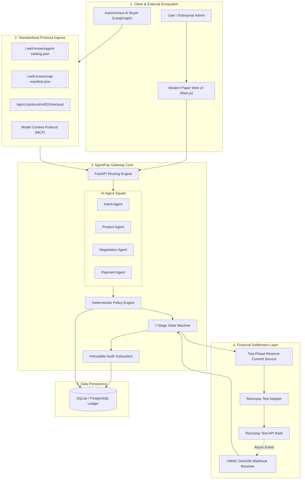
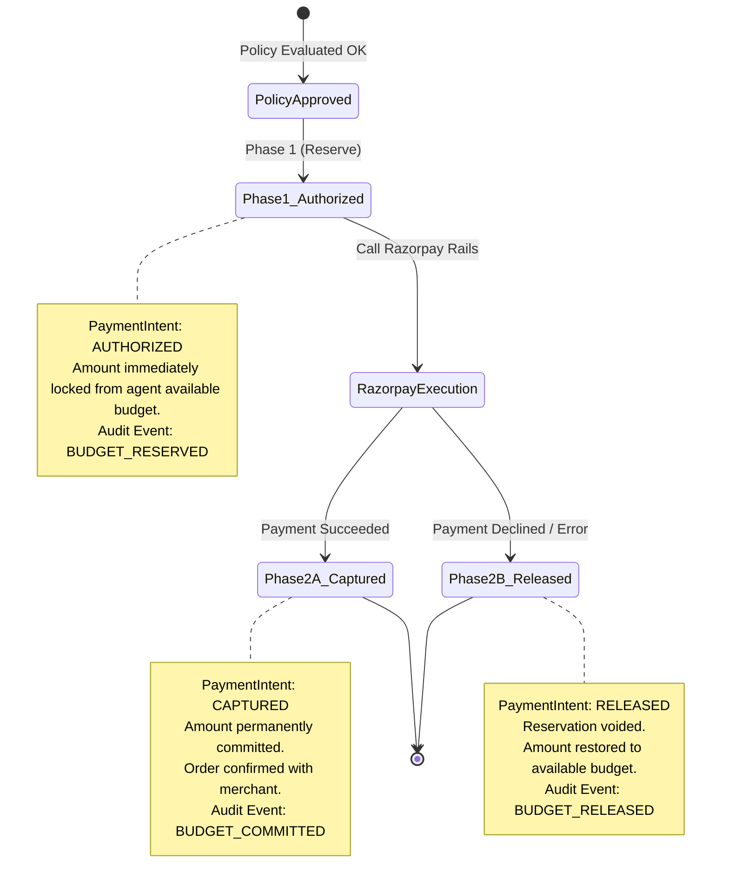
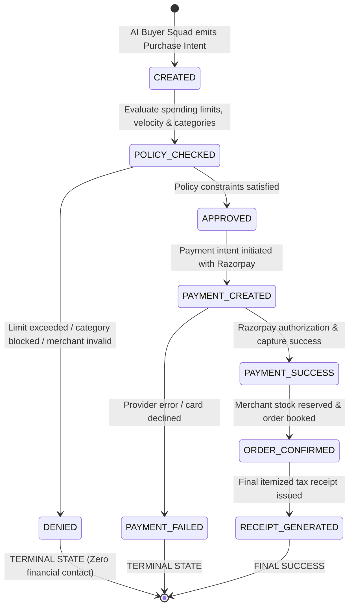

# AgentPay Architecture Diagrams (Excalidraw Compatible)

You can easily import these into Excalidraw by going to **Insert > Mermaid**, pasting the code, and clicking **Insert**.

## 1. High-Level System Architecture

This diagram shows the complete topology of AgentPay from the User/AI Layer all the way down to the Razorpay Settlement Rails.

---

## 2. Two-Phase Reserve-Then-Commit Lifecycle

This diagram illustrates how AgentPay secures the budget before making any calls to the Razorpay API, ensuring no financial leaks occur.

---

## 3. Transaction State Machine

This shows the deterministic 7 stages of a transaction, highlighting the terminal `DENIED` state which guarantees zero unauthorized charges.

